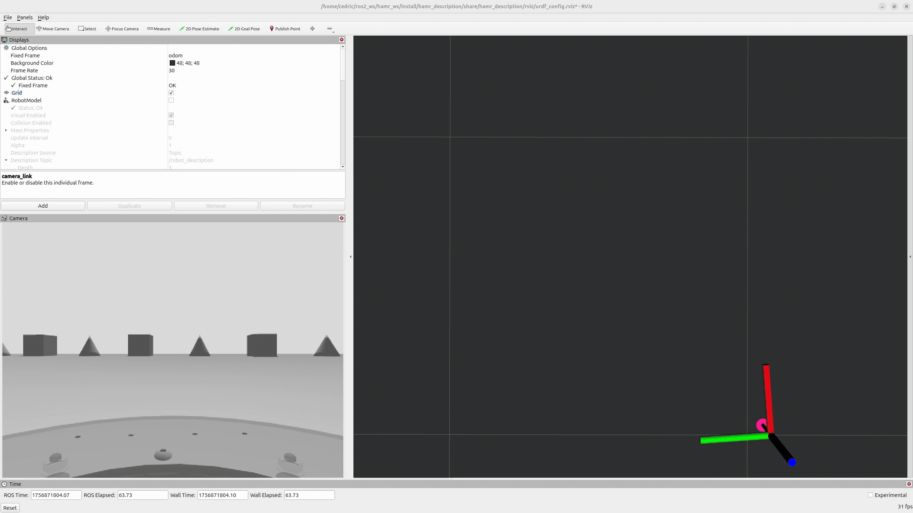
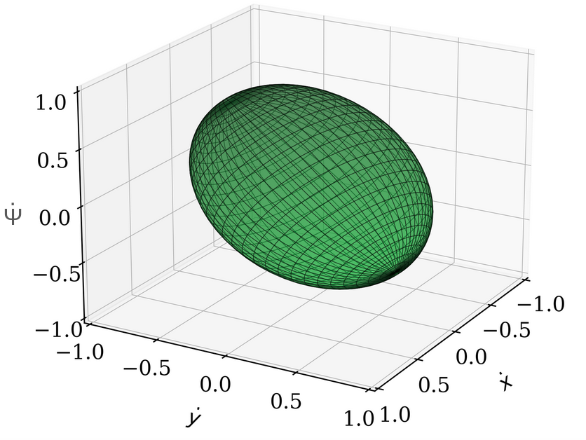

# HAMR & COMPA Holonomic Robots (ROS 2 Jazzy)

**Brief**: ROS 2 Jazzy packages for a holonomic base with an **offset turret**. Includes URDF/Xacro, Gazebo (gz sim) setup, a PID controller, and a waypoint-based reference trajectory for quick simulation. COMPA is a collaboration between the **University of Pennsylvania's GRASP ModLab** directed by Prof. Mark Yim, and **George Mason University's RobotiXX Lab** directed by Prof. Xuesu Xiao. The UPenn team is mostly focused on simulation, while the GMU team on the physical build of COMPA. See our paper for more information.

**Capabilities:** holonomic turret control on uneven terrain; rocker suspension; 3-DoF stabilized gimbal; Jacobian PID-based controller; Gazebo Off-Road worlds (from heightmaps); PRM/A* path-finding.

<!-- Hero: physical robot + Gazebo render -->
<p align="center">
  
  
</p>
<p align="center"><em>Left: COMPA Physical robot, Right: COMPA Simulated robot.</em></p>

---

## Introduction

Most mobile robots are **non-holonomic**: their kinematics prevent them from moving freely in all directions without reorienting. Differential-drive and Ackermann steering robots, for example, cannot instantly move laterally or follow arbitrary trajectories without stop-and-turn maneuvers.

**Holonomic robots**, in contrast, can command **lateral, longitudinal, and yaw motions independently**, enabling smooth path following, shorter local plans, and the ability to keep a payload at a fixed heading while moving in any direction. The **mobility ellipsoid** quantifies this: when actuator rates are bounded, the achievable twists form an ellipsoid; uniform axes imply high holonomicity. Traditional holonomic designs (Mecanum, omni, or ball wheels) work well on flat surfaces but lose traction in off-road environments.

This project builds on the **DDROT (Differential-Drive with Offset Turret)** concept and extends it to off-road deployment. The platform presented here, **COMPA (Compensated Holonomic Off-Road Mobile Platform with Attitude Control)**, combines:

* A **differential-drive base with rocker suspension** to maintain traction on uneven ground.
* An **actively stabilized 3-DOF gimbal** (roll, pitch, yaw) that keeps the turret level and oriented.
* A **Jacobian-based control framework** that decouples commanded turret motions from base irregularities.

The result is an off-road holonomic base that can execute **arbitrary trajectories (square, triangle, circle, maze, autonomous path, PRM/A\*)** in both simulation and real-world terrain, while maintaining stable payload orientation.

<!-- Small looping visualization + Mobility Ellipsoid -->
<p align="center">
  
  
</p>
<p align="center"><em>Left: Holonomy visualization (HAMR), Right: COMPA Mobility Ellipsoid.</em></p>

---

## COMPA Hardware and Simulation Overview

<p align="center">
  
</p>

* **Mobile base**: Two powered drive wheels on a rocker suspension, plus rear casters for support.
* **Turret**: Mounted on a gimbal providing active roll/pitch stabilization and independent yaw control.
* **Electronics**: Dual BLDC motors (ODrive), Arduino Mega for servo and sensor integration, IMU + encoder feedback, LiPo battery power system.
* **Simulation**: Full Gazebo URDF/Xacro with 2.5D heightmaps and digital twin validation.

---

## Holonomic Trajectories

Canonical experiments included **square, triangle, and circle trajectories**, as well as **maze navigation** using PRM/A\* planners. In both simulation and physical testing, the robot successfully demonstrated holonomic control, with the turret maintaining orientation independent of the base. Here are some [simulation videos](https://drive.google.com/drive/folders/1EY-bJhKYq_guximBzEeTff3mIo9-671F?usp=drive_link).

<p align="center">
  
  
  
</p>

<p align="center"><em>Canonical holonomy tests on uneven heightmaps (square, triangle, circle).</em></p>

<p align="center">
  
<p>

<p align="center"><em>Holonomy test on an uneven maze heightmap, using PRM and A*.</em></p>


### Results (sim & hardware)
| Path      | RMSE (sim, m) | RMSE (hw, m) | Yaw Std (rad, hw) |
|-----------|----------------|--------------|-------------------|
| Square    | 0.040          | 0.178        | 0.107             |
| Triangle  | 0.041          | 0.197        | 0.160             |
| Circle    | 0.022          | 0.101        | 0.050             |
| Maze      | 0.018          | N/A          | N/A               |

Same Jacobian + PID controller in sim and on the robot; circle yields best heading stability, sharp turns tax yaw authority as expected from the mobility-ellipsoid view.

---

### Kinematics (simplified to mobile base + yaw turret)

$$
\begin{aligned}
\mathbf{v} &\equiv \begin{bmatrix}\dot x & \dot y & \dot\psi\end{bmatrix}^\top
= J(\psi) ⋅ \boldsymbol{\omega},\quad
\boldsymbol{\omega} \equiv \begin{bmatrix}\omega_r & \omega_\ell & \omega_t\end{bmatrix}^\top \\
J(\psi) &=
\begin{bmatrix}
\frac{r_w}{2} \left(c-s\frac{b}{a}\right) & \frac{r_w}{2} \left(c+s\frac{b}{a}\right) & 0 \\
\frac{r_w}{2} \left(s+c\frac{b}{a}\right) & \frac{r_w}{2} \left(s-c\frac{b}{a}\right) & 0 \\
\frac{r_w}{2a} & -\frac{r_w}{2a} & 1
\end{bmatrix},\quad c=\cos\psi,\ s=\sin\psi
\end{aligned}
$$

**Holonomicity:** 

$\(\displaystyle \hat H=\frac{\sigma_{\min}(J)}{\sigma_{\max}(J)}\)$


---

### Key topics
| Topic                    | Type                                | Notes                                  |
|--------------------------|-------------------------------------|----------------------------------------|
| `/left_wheel/cmd_vel`    | `std_msgs/msg/Float64`              | Left wheel rate command (rad/s) → ω_ℓ  |
| `/right_wheel/cmd_vel`   | `std_msgs/msg/Float64`              | Right wheel rate command (rad/s) → ω_r |
| `/roll/cmd_vel`          | `std_msgs/msg/Float64`              | Gimbal roll rate/target  → ω_roll      |
| `/pitch/cmd_vel`         | `std_msgs/msg/Float64`              | Gimbal pitch rate/target     → ω_pitch |
| `/yaw/cmd_vel`           | `std_msgs/msg/Float64`              | Turret yaw rate/target → ω_yaw         |
| `/reference_trajectory`  | `hamr_interfaces/msg/ReferenceTraj` | Interpolated reference poses           |
| `/compa/odom`            | `nav_msgs/msg/Odometry`             | Odometry for outer-loop PID            |


---

## Installation (Ubuntu 24.04 + ROS 2 Jazzy)

### 1) Workspace & clone

```bash
mkdir -p ~/ros2_ws/src
cd ~/ros2_ws/src
git clone https://github.com/cedrichld/hamr_holonomic_robot.git
```

### 2) Source ROS 2 (now and on login)

```bash
source /opt/ros/jazzy/setup.bash
# Optional: add to ~/.bashrc
echo 'source /opt/ros/jazzy/setup.bash' >> ~/.bashrc
```

### 3) Build

```bash
cd ~/ros2_ws
colcon build --symlink-install
source ~/ros2_ws/install/setup.bash
# Optional: add to ~/.bashrc
echo 'source ~/ros2_ws/install/setup.bash' >> ~/.bashrc
```

### 4) Resources for meshes/STLs and worlds (required)

```bash
export GZ_SIM_RESOURCE_PATH="$(ros2 pkg prefix hamr_description)/share":$GZ_SIM_RESOURCE_PATH 
export GZ_SIM_RESOURCE_PATH="$(ros2 pkg prefix compa_description)/share":$GZ_SIM_RESOURCE_PATH
export GZ_SIM_RESOURCE_PATH="$(ros2 pkg prefix hamr_bringup)/share":$GZ_SIM_RESOURCE_PATH
# Optional: add to ~/.bashrc
echo 'export GZ_SIM_RESOURCE_PATH="$(ros2 pkg prefix hamr_description)/share":$GZ_SIM_RESOURCE_PATH"' >> ~/.bashrc
echo 'export GZ_SIM_RESOURCE_PATH="$(ros2 pkg prefix compa_description)/share":$GZ_SIM_RESOURCE_PATH"' >> ~/.bashrc
echo 'export GZ_SIM_RESOURCE_PATH="$(ros2 pkg prefix hamr_bringup)/share":$GZ_SIM_RESOURCE_PATH"' >> ~/.bashrc
```

---

## Running a Trajectory

**Terminal A** (Gazebo + bringup):

```bash
source /opt/ros/jazzy/setup.bash
source ~/ros2_ws/install/setup.bash
ros2 launch hamr_bringup compa.launch.xml
```

**Terminal B** (reference trajectory):

```bash
source /opt/ros/jazzy/setup.bash
source ~/ros2_ws/install/setup.bash
ros2 run reference_trajectory waypoint_traj_simple # square, triangle, or circle
```

---

## Example Waypoints

```python
# Square trajectory with constant heading
waypoints = np.array([  
    [0.0, 0.0, 0.0],  
    [5.0, 0.0, 0.0],
    [5.0, 5.0, 0.0],
    [0.0, 5.0, 0.0],
    [0.0, 0.0, 0.0]
])
```

---

## Micro ROS Bridge

Run the bridge in a separate terminal (or include in launch):

```bash
ros2 run hamr_uros_bridge relay_node
```
