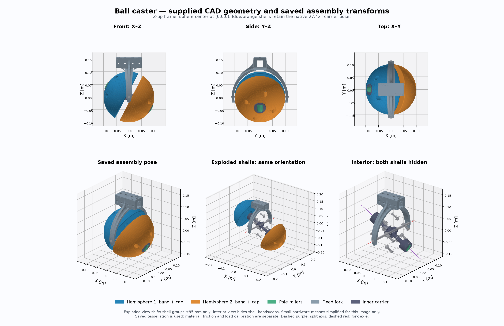

# Ball-caster CAD findings and modeling decisions

The new caster model recovers the supplied CAD's saved component geometry and placement. It represents the two split spherical sides and the two small polar rollers separately. Its material properties and bearing behavior remain engineering assumptions until measured on the physical mechanism. The COMPA variant is a retrofit into the existing simulation, not a complete new export of the HAMR3 robot.



The [assembly views](cad_assembly_views.png) use the recovered meshes and native occurrence transforms. The exploded view translates the two shell groups without rotating them. The interior view hides the four shell parts. Display-only reduction of dense vendor hardware is documented in [geometry notes](../assets/provenance/geometry_notes.md); the URDF uses the original recovered meshes.

## Sources and reproducibility

The original source is `CAD files/HAMR3-2/Ball Caster Assembly.SLDASM` and its referenced PART files, now retained in the [external CAD archive](ARCHIVED_ARTIFACTS.md). These modern SolidWorks files use a version-4 compressed block envelope. [extract_assembly.py](../tools/extract_assembly.py) locates the block marker, decodes the section name, inflates raw DEFLATE, and accepts a section only when both its uncompressed size and CRC-32 match. All processing is local.

The native `swXmlContents/COMPINSTANCETREE` section records component instances, saved configurations, visibility, bounding boxes and transforms. [assembly.json](../assets/provenance/assembly.json) preserves all 45 active occurrences, covering 16 unique part types. It also retains source hashes, stream CRC and location, selected whole-robot placements, and recovered mate names with their referenced components.

[extract_cad.py](../tools/extract_cad.py) recovers saved display tessellation using sldkit. [extraction.json](../assets/provenance/extraction.json) records every PART and mesh hash, configuration, topology check, analytic surface record and parser limitation. All 16 recovered meshes are closed, consistently wound and have positive volume. These checks establish valid triangle topology; they do not prove that every native design feature was rebuilt correctly. The parser reports partial results, and no SolidWorks feature-tree rebuild was performed.

The container decoder is informed by the [cadmpeg project's format documentation](https://github.com/cadmpeg/cadmpeg/blob/main/docs/formats/sldprt.md), then checked against the actual file CRCs and XML. That format documentation is an unofficial reverse-engineered description.

## Units and coordinate transforms

Geometry in the exported meshes and URDF is in meters. Angles in URDF are radians. SolidWorks display units do not change the internal geometric length scale used here.

The native XML stores a row-vector transform: its translation appears in entries 12–14 of `swTransform`. The extractor transposes that 4 × 4 matrix into the conventional column-vector form:

```text
p_assembly = T_occurrence × p_part
```

This transpose is essential: interpreting the native list directly as a conventional row-major robotics matrix would misplace the parts. All 45 extracted rotation matrices were checked for orthonormality and determinant +1. Parent-child matrices are composed when reading the whole-robot snapshots.

The standalone assembly itself is not Z-up. The fork mounting block extends in native −Z; the main axle lies along native X. The generated macro uses the proper rotation:

```text
Q = [ 0 -1  0 ]
    [-1  0  0 ]
    [ 0  0 -1 ]

p_caster = Q × p_native
```

Thus native −Z becomes simulation +Z, native X becomes simulation −Y, and the socket's native Y direction becomes simulation −X. This agrees with the native robot using CAD +Y up and a chosen ROS convention of forward = −CAD-global-Z, left = −CAD-global-X, up = CAD-global-Y.

## What the two hemispheres actually contain

There are four shell occurrences, not two identical complete hemisphere meshes:

| Assembled side | Equatorial band | Polar cap |
| --- | --- | --- |
| Positive side | `Semi-Spherical Wheel-1` | `Semi-Spherical Wheel 2-1` |
| Negative side | `Semi-Spherical Wheel-2` | `Semi-Spherical Wheel 2-2` |

The `2` in the second PART's name identifies the cap design. It is separate from the trailing occurrence number. The band and cap have their own native rotations, including the phase of the bolt holes; those rotations are retained.

| Recovered dimension | Value |
| --- | --- |
| Nominal outer spherical radius | 100 mm |
| Band extent along its local +Y axis | 10–40 mm |
| Cap extent along its local +Y axis | 40–96.824583655 mm |
| Gap between opposing band faces | 20 mm |
| Polar-roller center distance from sphere center | 90.38 mm |
| Fork socket cross-section | 25.64 × 25.64 mm |
| Fork socket center above ball center, in the Z-up frame | 131.62 mm |

Both sides share the same spherical center, to floating-point precision. Their flat faces face one another across the gap. Translating the two sphere centers apart, or creating two overlapping full-sphere contact shapes, would describe a different mechanism.

In the saved standalone pose, the positive shell's axis is:

```text
native a = (0, +0.887645731278796, −0.460526932700500)
Z-up Q a = (−0.887645731278796, 0, +0.460526932700500)
```

The negative shell axis is the opposite vector. This inclination is a saved articulation phase. The embedded caster snapshot in both `HAMR3-3.SLDASM` and `HAMR3-2.SLDASM` instead has approximately `a = (0, 0.77071422, 0.63718097)`, while retaining the same sphere center and main axle. It is therefore not a fixed design camber angle that should be imposed relative to the floor.

At `carrier_phase=0` and zero joint positions, the macro preserves the standalone snapshot's orientations after applying Q. Changing `carrier_phase` rotates the entire carrier and all its children about the carrier axle. It does not independently tilt or translate the shells. Subsequent joint motion changes this articulation naturally.

## Five passive rotational degrees of freedom

The URDF reduces the assembly to six rigid bodies, connected by five continuous revolute joints. The fork is fixed to its mounting parent. All five caster joints are passive.

```text
fork + fixed main axle
└── carrier — rotates about native X
    ├── positive hemisphere — rotates about +a
    ├── negative hemisphere — rotates about −a
    ├── positive polar roller — rotates about +b at +90.38 mm a
    └── negative polar roller — rotates about −b at −90.38 mm a
```

Here `b = (0, 0.46052693270050, 0.88764573127880)` in the native standalone frame. Main axle X, split axis a and polar-roller axis b are mutually perpendicular. `Roller-2` is the positive polar roller; `Roller-1` is the negative one.

The roller holders and small roller shafts belong to the carrier. Their orientations do not follow a hemisphere's spin. The small rollers themselves have their own joints, allowing the open polar regions to roll rather than behave as fixed rubbing surfaces. Native mate references including `Coincident171/172` connect the central bearing shaft to the roller mounts; other coincidence references connect those mounts to the roller shafts.

The kinematic arrangement is inferred from geometry, shafts, bearings, component placements, changing saved articulation and mate-reference names. The binary mate lock flags and full constraint semantics were not decoded. It is a documented mechanical interpretation, not a claim that a native CAD constraint solver was executed. Internal self-collision is disabled for the reduced caster: bearing constraints are represented by joints rather than contact between individual bearing races.

The contact geometry retains the separate band, cap and polar-roller meshes. Their holes, central gap, faceting and support changes matter. Current rolling-component vertices reach approximately 101.799 mm from the sphere center, so a 100 mm perfect sphere is not an exact contact proxy at every phase. At the saved standalone phase, the lowest shell vertex is approximately −99.954 mm in the Z-up frame.

## Rigid groups and mass properties

Every occurrence keeps its measured saved transform. The following grouping determines which parts move together and where their mass is accumulated:

| Group | Occurrences | Components and approximation |
| --- | ---: | --- |
| Fork | 2 | Fork and main cross axle; axle is assumed fixed to the fork. |
| Carrier | 17 | Central bearing shaft, collet blocks, roller holders and shafts, needle/roller-support bearings, spacer pieces. Spacer and bearing grouping is a reduction of the mechanical assembly. |
| Positive shell | 13 | Band, cap, four screws, four nuts, one skate bearing, two flange-bearing solids. |
| Negative shell | 11 | Band, cap, four screws, four nuts, one skate bearing. |
| Positive polar roller | 1 | Roller-2. |
| Negative polar roller | 1 | Roller-1. |

Both flange-bearing occurrences occupy the positive side in the supplied native snapshot. The model retains that placement and its resulting mass asymmetry; it does not silently mirror one to the opposite side. A single bearing CAD solid cannot describe separate moving races. Bearings are consequently lumped into the supported shell or carrier and their losses are represented by configurable joint damping/friction.

The shell histories explicitly contain `Material <not specified>`. Appearance strings such as `Steel` and `defaultplastic` do not establish density. [physical_properties.yaml](../config/physical_properties.yaml) therefore labels all densities and bearing losses as assumptions. Its initial density assumptions include 1200 kg/m³ for shell polymer, 2700 kg/m³ for the fork/collet aluminum approximation, and 7850 kg/m³ for steel hardware. These are not measured hardware properties.

Closed-mesh integration supplies volume, center of mass and inertia per unit density. The generator rotates each part's inertia into its link frame and combines components using the parallel-axis theorem. It checks the resulting inertia tensors. Optional measured part masses can replace assumed densities. The resulting group values and configuration hash are in [model_properties.json](../assets/provenance/model_properties.json). Printed infill, material compliance, tire friction, bearing preload and actual mass distribution still require calibration.

## Conflicting saved CAD representations

The simulation combines the current supplied PART tessellations with native occurrence transforms. Several saved representations disagree:

- The main axle's current recovered mesh is 230 mm long, while its assembly bounding-box cache describes 210 mm.
- Fork bounding boxes differ by as much as 9.14 mm between representations.
- Roller and roller-shaft bounding-box differences reach approximately 1.61 mm and 1.05 mm.
- The band's thumbnail shows tread-like markings, while its saved display mesh and decoded spherical surface describe a smooth band. There is one matching saved configuration. A stale thumbnail or an appearance effect cannot be distinguished conclusively here.
- The full-robot snapshots and standalone caster have different carrier phases and fork visibility.

The numeric differences and parser losses remain in the provenance files. Geometry was not stretched to make conflicting caches agree, and no tread was invented. An authoritative SolidWorks rebuild followed by fresh STEP/STL exports would resolve these ambiguities. Until then, this is an audited recovery of saved geometry with explicit limitations.

## COMPA retrofit and mounting review

The existing COMPA model provides the rocker linkage, drive joints, controllers and other body geometry. Replacing its simple cylindrical caster links with this macro gives the existing simulation the split ball-caster mechanism. It does not make the rest of that model a geometry-identical export of the supplied HAMR3 CAD. For example, the legacy drive collision radius is 107.5 mm, while the supplied native robot's drive-wheel bounding box indicates 130 mm.

The fork has a useful measurable attachment reference: the square rail channel is bounded by native `x = ±12.82 mm` and `z = −144.44, −118.80 mm`, centered at `(0,0,−131.62 mm)`. A mesh cross-section through native `y=0` independently confirms those bounds. This is a measured channel center, not a native named coordinate system. The outermost fork plane at native z = −156.42 mm is not the rail center.

For the retrofit, a 25.4 mm square rail fits that 25.64 mm channel with 0.24 mm total nominal clearance per transverse dimension. In the `compa_back` orientation used by this variant, the rail center is rocker-local `y = +0.072` for the left rocker or `−0.072` for the right rocker, and `z = −0.021`. With those coordinates, the corresponding ball center is:

```text
rocker-local ball center z = −0.021 − 0.13162 = −0.15262 m
```

Using longitudinal ball center x = 0.315 m retains the old caster station. At nominal zero rocker angle, the legacy drive collision bottom is `−0.1442 − 0.1075 = −0.2517 m`. The nominal new shell bottom is `−0.15262 − 0.100 = −0.25262 m`, a difference of 0.92 mm. This is close enough for a freely moving rocker to settle with a small change of angle; it is not proof of exact static contact alignment. Actual faceting, pole-roller protrusion, the seam, contact stiffness and carrier phase can change support height by millimeters.

The variant resolves two problems with retaining the old rocker geometry:

1. The old rocker STL includes the old caster wheel and bracket. The variant replaces its rocker visual with the square rail and removes both old caster links and joints, so the old wheel is not drawn beneath the new assembly.
2. The old rocker collision was 37 × 50 mm, too large for the 25.64 mm socket. The new visual and collision rail is 665.8 × 25.4 × 25.4 mm, centered at rocker-local x = 0.0329 m. Its longitudinal extent is x = −0.3000 to +0.3658 m. The new socket spans x = +0.2642 to +0.3658 m, so the rail fully traverses its 101.6 mm channel. The socket and rail transverse centerlines coincide.

The inherited rocker mass is retained, while its center of mass and box inertia are recomputed for the new rail representation. This is a simulation reduction; it is not a measured mass model of a newly manufactured square rail.

[The retrofit checks](../test/test_compa_retrofit.py) verify complete socket engagement, nominal contact-height compatibility, removal of the old embedded visuals, ten independent unactuated caster joints, and the provenance hashes of the untouched source descriptions. Triangle-versus-box separation checks also verify that caster collision meshes clear conservative bounds of the existing chassis collision primitives at neutral rocker positions and carrier phases of 0 and 1.1 rad. These are selected-configuration geometric checks, not an all-configuration swept-volume test.

The new rail is an adaptation of the legacy simulation. Its attachment clearances are geometric checks, not a verified bolt design or a manufactured bracket specification. Retaining the legacy body/linkage masses and control settings, with the adapted rail COM/inertia above, also retains other pre-existing physical approximations; the complete robot's total inertia and load distribution should be measured before claiming quantitative hardware accuracy.
