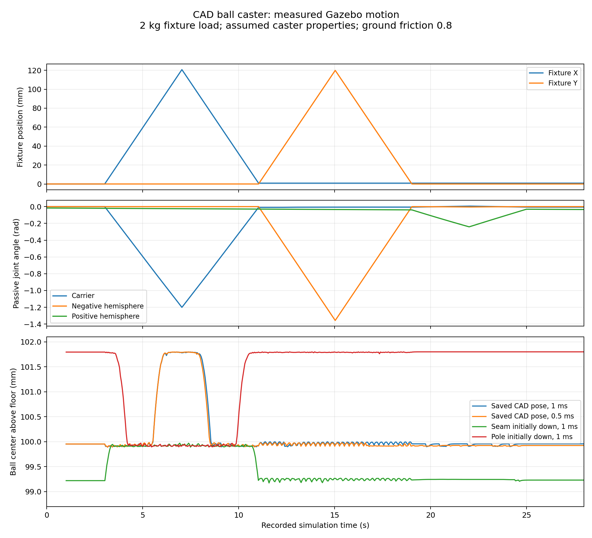
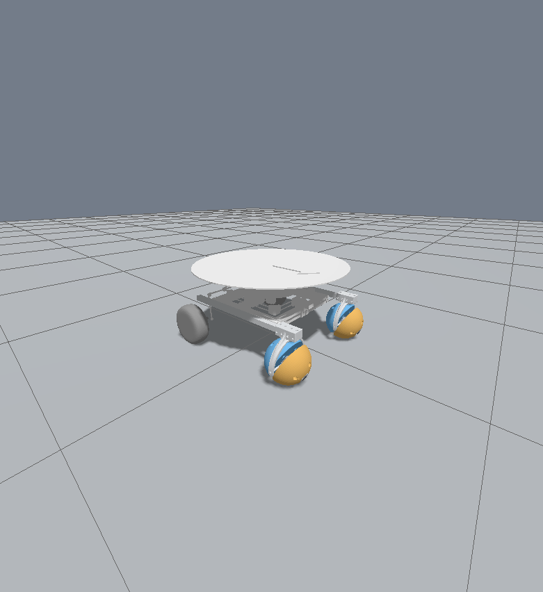

# Validation of the CAD caster pipeline

Commands in this guide assume a checkout of this repository. From any directory
inside that checkout, set these portable paths before running the examples:

```bash
export HAMR_REPO="$(git rev-parse --show-toplevel)"
export HAMR_RUNS="${HAMR_RUNS:-$HOME/Videos/hamr_sim}"
```

Recorded videos and full run reports are external artifacts, not files supplied
by a Git clone. Paths under `${HAMR_RUNS}` identify retained runs or new outputs
created by the recording commands.

Validation was performed on 2026-09-20 in this Ubuntu 24.04 WSL2 system with ROS 2
Jazzy, Gazebo Sim 8.15.0, SDFormat 14.9.0, and DART using the ODE collision detector
and Dantzig constraint solver. The GUI rendered through WSLg/Ogre2 with llvmpipe.
The runtime package versions and SHA-256 hashes are recorded in
[rootless_gazebo_packages.json](../assets/provenance/rootless_gazebo_packages.json).

These checks establish geometry consistency, runnable integration and stability
for the tested slow motions. They do not establish calibrated agreement with the
manufactured caster.

The later complete `waypoint_traj_simple` recording also passed. It ran the full
13 m route at 0.25 m/s with both casters, produced a verified 63.56-second MP4,
and measured 12.7 mm RMS / 64.0 mm peak position error. The build now passes
25 pytest cases, including exact compatibility with the original reference
interpolation and preservation of all physics when overview rendering is used.
See the [recording guide](RECORDING.md) and
[full-run evidence](validation/full_waypoint_recording.json).

## Geometry and assembly

Both expanded URDFs parse with `check_urdf`. Building with
`bash hamr_ball_caster/scripts/build.sh` passes **17 pytest cases** across the two
test files (the colcon aggregate additionally counts the two CTest wrappers).

The checks cover:

- All 45 occurrence transforms at the saved pose, and coherent carrier rotation.
- Five passive degrees of freedom, opposed hemisphere axes, independent shell
  rotation, polar-roller placement and positive physical inertia tensors.
- The 100 mm spherical radius, 20 mm seam, polar openings, mesh hashes, and mass
  scaling. All 16 exported part meshes are closed and consistently wound.
- Two casters in COMPA with ten passive joints, removal of old caster links and
  embedded visuals, complete rail/socket engagement and nominal support alignment.
- Collision-triangle clearance from conservative chassis primitive bounds at
  neutral rockers and two carrier phases. This is a selected-pose check, not a
  complete swept-volume analysis.
- A checker regression ensuring fixed mounting joints cannot mask a missing
  passive caster degree of freedom.

The [CAD findings](CAD_FINDINGS.md) explain the reconstructed axes and the
remaining native-file ambiguities. Mesh consistency cannot substitute for a
SolidWorks feature-tree rebuild or a physical measurement.

## Loaded fixture in Gazebo

Each case used the nominal 5.338 kg caster estimate plus a 2 kg fixture load,
ground friction 0.8, and the five unactuated caster joints. The 28-second sequence
was: settle; X forward/reverse at 0.03 m/s; Y forward/reverse at 0.03 m/s; yaw
forward/reverse at 0.15 rad/s; settle. Each translation lasts four seconds, each
yaw and settling phase three seconds.

| Case | Timestep | Carrier phase | Final ball-center height | Result |
| --- | ---: | ---: | ---: | --- |
| [Saved CAD pose](validation/rig_dt_001.json) | 1 ms | 0 | 99.957 mm | PASS |
| [Smaller timestep](validation/rig_dt_0005.json) | 0.5 ms | 0 | 99.924 mm | PASS |
| [Seam initially down](validation/rig_seam.json) | 1 ms | 0.478589 rad | 99.232 mm | PASS |
| [Positive pole initially down](validation/rig_pole.json) | 1 ms | 2.049385 rad | 101.800 mm | PASS |

Final heights are medians of the last recorded simulation second, computed as
`0.11 + rig_z_joint`. The initial saved-pose height settled at approximately
99.954 mm, matching the lowest recovered mesh vertex. The seam and pole cases
support the fixture at different heights, as expected from their actual geometry.
The free vertical slide remained supported by ground contact rather than resting
on its lower joint limit.

The baseline X-forward phase traveled 119.16 mm with 1.18548 rad carrier rotation.
The Y-forward phase traveled 118.32 mm with 1.33937 rad negative-hemisphere
rotation. Different recorded phase lengths reflect asynchronous 20 Hz sampling
and command delivery; the nominal translation is 120 mm per phase. Both shell
groups can move independently, and the pole case reached 2.63 rad/s at a passive
roller without instability. All four cases reported finite states and settled
successfully.



The lower plot excludes the first second of the initial drop only for readability.
The JSON files retain all samples, including those transients. The original
baseline checker was started after the fixture had already settled; the other
cases began recording during startup. The later comparison uses phase travel and
terminal support heights, rather than treating those startup windows as identical.

### Timestep comparison

Halving the timestep changed the final median support height by **0.0330 mm**.
To account for slightly different sampled travel, compare passive rotation per
meter rather than raw endpoint angles:

| Quantity | 1 ms | 0.5 ms | Relative difference |
| --- | ---: | ---: | ---: |
| X-forward carrier rotation / travel | 9.948681 rad/m | 9.948630 rad/m | 0.000512% |
| Y-forward shell rotation / travel | 11.319931 rad/m | 11.319126 rad/m | 0.00711% |

This is evidence of numerical consistency for these motions and settings. It is
not a general convergence proof for high speed, impacts, different loads or
friction values. In particular, rotation/travel ratios alone do not measure
individual contact-point slip or ground reaction force.

Reproduce the four isolated simulations:

```bash
source "${HAMR_REPO}/hamr_ball_caster/scripts/env.sh"
ros2 run hamr_ball_caster run_physics_suite.py --output /tmp/caster_validation
/usr/bin/python3 "${HAMR_REPO}/hamr_ball_caster/tools/summarize_validation.py" \
  --directory /tmp/caster_validation
```

The summary tool creates PNG/PDF plots and `timestep_comparison.json`. The retained
`suite_results.json` covers the three cases run by the suite during development;
the baseline was run separately with the same motion checker. All four individual
JSON reports contain their own pass/failure result.

## COMPA retrofit

The [COMPA report](validation/compa_motion.json) contains 297 recorded samples
from 15 simulation seconds: initial settle, three seconds forward, stop, three
seconds reverse, final settle. The model used the default 1 ms timestep and
friction 0.8, with the optional legacy controller disabled.

| Check | Measured result |
| --- | --- |
| Both wheel commands +0.3 rad/s | +94.43 mm X displacement |
| Both wheel commands −0.3 rad/s | −95.77 mm X displacement |
| Caster articulation | All ten named passive joints present; both carriers roll |
| Maximum absolute body roll/pitch | 0.00460 rad, about 0.263 degrees |
| Approximate base-link height | 215.98–216.85 mm |
| Suspension loop relative-frame drift | Below 3e-10 m and 4e-8 rad numerically |
| Motion/support/finite-state checks | PASS |

Loop drift was reconstructed independently from the URDF and recorded joint
positions. It checks that the detachable-joint loop closure stays constrained
during this run; the tiny numerical residual is not a claim of submicron physical
accuracy. Base-link height is estimated from odometry and its 0.22 m root offset;
the body tilt is small in this sequence.



The GUI showed both attached split casters and no remnants of the old casters.
The original HAMR/COMPA description source hashes still match the recorded
provenance. The separate retrofit and copied complete meshes are self-contained
for this launch.

Reproduce after launching `model:=compa`:

```bash
source "${HAMR_REPO}/hamr_ball_caster/scripts/env.sh"
ros2 run hamr_ball_caster run_compa_checks.py --output /tmp/compa_motion.json
```

## Accuracy limits

The supplied CAD does not establish shell materials, print infill, measured
mass distribution, bearing preload/drag, contact friction or compliance. The
model uses explicit engineering assumptions for these quantities. Its bearings
are reduced joints and its ground contact is rigid and faceted. Internal
self-collision is disabled for the caster reduction.

Saved CAD representations disagree in several dimensions, and full binary mate
lock semantics were not decoded. Geometry, native component matrices and mate
reference evidence support the chosen five-joint mechanism, but a native CAD
rebuild and hardware review remain the strongest independent checks.

The COMPA chassis retains legacy drive, mass and controller approximations and
has adapted mounting rails. These tests do not certify a physical mounting
design, the complete HAMR3 CAD robot, tire forces, slip accuracy, obstacle
performance or long-duration stability. See the calibration steps in the
[operating guide](../README.md).
