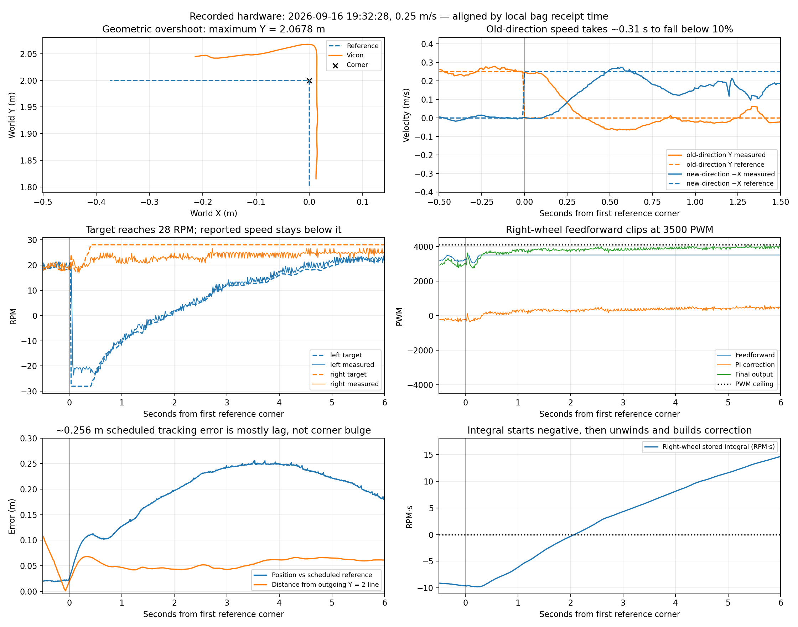

# Recorded hardware corner-response audit

Commands in this guide assume a checkout of this repository. From any directory
inside that checkout, set these portable paths before running the examples:

```bash
export HAMR_REPO="$(git rev-parse --show-toplevel)"
export HAMR_RUNS="${HAMR_RUNS:-$HOME/Videos/hamr_sim}"
```

Recorded videos and full run reports are external artifacts, not files supplied
by a Git clone. Paths under `${HAMR_RUNS}` identify retained runs or new outputs
created by the recording commands.

20 September 2026. Read-only analysis of the three supplied 16 September MCAP recordings and the current source tree. No hardware was actuated and no production parameters were changed.

**The recordings show two distinct effects: a roughly 5–7 cm geometric corner overshoot, followed by substantially larger error against the moving, time-scheduled reference.** At the first corner of `hamr_hw_20260916_193228`, the tracked point passes the outgoing `Y = 2 m` line by **67.8 mm**. The maximum time-aligned position error later reaches **255.8 mm**, principally because the robot falls behind along the new segment. These should not be reported as the same “overshoot.”



The evidence supports an infeasible instantaneous direction change, wheel-speed limiting, and imperfect loaded wheel response as major causes. It does **not** support a wrong Jacobian formula as the primary cause. The available data does not isolate torque, battery voltage, tire slip, or caster resistance individually.

## Which controller is actually active

The normal [hardware launch](../../../hamr_bringup/launch/hamr_HW.launch.xml) lines 7–8 and 63–72 loads `hamr_hw_control_params.yaml` into executable `hamr_controller`. [setup.py](../../../hamr_control/setup.py) maps that executable to `hamr_control.hamr_controller:main`. The similarly named `hamr_controller_hw.py` is explicitly deprecated and is not this entry point. In particular, its `use_diff_drive = True` setting is not evidence that the active robot is being driven as an ordinary differential-drive robot.

Current [hardware settings](../../../hamr_bringup/config/hamr_hw_control_params.yaml):

| Quantity | Current setting |
|---|---:|
| Wheel radius `r_wheel` | 0.122 m |
| Half-track `a_wheel` | 0.350 m |
| Controlled-point offset `b_wheel` | 0.301 m |
| Vicon-to-kinematic yaw correction | +π/2 |
| XY P / D / I | 0.7 / 0.4 / 0 |
| D filter nominal alpha | 0.2 at 100 Hz |
| Wheel-pair limit | 2.932153 rad/s = 28 RPM |
| Controller / serial transmit rate | 100 / 100 Hz |
| Controller feedback | `/HAMR_base/odom`, raw Vicon |
| XY velocity feedback | Vicon twist, explicitly world-frame |
| Turret enabled | false |

The main controller [PID step](../../../hamr_control/hamr_control/hamr_controller.py) lines 960–1102 computes `v_command = v_reference + P × position_error + D × filtered_velocity_error + I_term`. Lines 1001–1027 use analytic `v_reference − v_measured`, with elapsed-time-adjusted filtering. This is not a finite difference of a discontinuous position target and does not create an infinite D kick. At a corner the reference **velocity** itself changes discontinuously, however, so a finite, meaningful D correction appears. In the recordings its peak is about 0.09–0.11 m/s, substantial relative to the 0.25 m/s reference.

The wheel mapping at lines 1463–1489 implements the offset-point Jacobian. Lines 1571–1585 scale **both wheels together** when the larger magnitude exceeds the limit. This preserves their ratio, but reduces both components of the desired planar velocity. There is no trajectory rescheduling or preview here: the timed reference continues ahead while the robot is limited.

The XY outer-loop integral gains are zero and the recorded `/live_gains` XY I terms are identically zero. Therefore **outer-loop XY integral windup cannot explain these recordings**. This is separate from the active **firmware wheel-speed PI integrals**, discussed below.

With `turret_enabled: false`, turret output is hard-zeroed after the solve. The two wheel commands remain those for the offset controlled point; disabling the turret does not remove XY controllability. Independent world-yaw tracking of the upper body is unavailable. All three bags also record zero turret commands and zero yaw PID contributions.

## Recorded facts and timing

Every recorded `/reference_trajectory` message in these three bags requests speed **0.25 m/s**. At approximately 8, 16, 26, and 34 seconds after its first message, the direction jumps by 90°. No corner slowdown or finite-duration blend appears. The recordings end before the full 52-second, 13-m reference completes; this audit concerns their recorded corner windows.

The table below uses `hamr_hw_20260916_193228`. “Additional old-direction motion” measures movement after the direction switch, independently of whether the robot was already ahead or behind the corner. “Geometric overshoot” is distance past the corner in the old travel direction. Time-aligned peak is measured within six seconds after the switch.

| Reference corner time | Direction change | Geometric overshoot | Additional old-direction motion | Old speed first below 10% | Peak time-aligned XY error | Target at 28 RPM, next 4 s | Median reported speed of capped wheel |
|---:|---|---:|---:|---:|---:|---:|---:|
| 8.005 s | +Y → −X | 67.8 mm | 49.1 mm | 0.307 s | 255.8 mm at +3.52 s | 98.85% | 22.97 RPM |
| 16.005 s | −X → +Y | 0 mm | 60.3 mm | 0.323 s | 204.5 mm at +3.29 s | 98.85% | 23.56 RPM |
| 26.006 s | +Y → +X | 62.0 mm | 56.1 mm | 0.306 s | 168.3 mm at +3.31 s | 98.85% | 24.61 RPM |
| 34.007 s | +X → −Y | 52.2 mm | 49.6 mm | 0.294 s | 150.8 mm at +3.01 s | 98.85% | 24.74 RPM |

The second corner's zero overshoot does not mean perfect tracking: the vehicle begins that switch about 69 mm short in the old direction, travels another 60 mm, and therefore turns before fully reaching the geometric corner.

The `190842` recording repeats the pattern: first-corner geometric overshoot **67.0 mm**, additional old-direction motion **47.3 mm**, and time-aligned peak **263.9 mm**. Its four next-four-second wheel-target cap fractions are 97.3–99.2%. The `184054` recording repeats the first-corner overshoot at **66.3 mm**, but later stops commanding motion while the reference continues; its large later errors are not clean corner-performance measurements. No reason for that stop is asserted from the available data.

All statistics use the same local bag receipt-time coordinate for reference, Vicon, and actuator telemetry. They do not equate this to sensor acquisition time. Vicon's remote source clock is unsynchronized; interpolation and callback scheduling create millisecond-scale matching uncertainty. “First below 10%” and “first above 90%” are sample crossings, not settled-response specifications. No filtered Vicon path was invented.

In `193228`, median receipt intervals are about 10.0 ms for references/commands, 8.2 ms for Vicon, and 14.6 ms for firmware status. P99 intervals are 14.2, 20.2, 38.0, and 22.9 ms, respectively. Some much longer gaps occur elsewhere in the bag. A coarse target-command cross-comparison is best around a 20 ms shift, but that combines transmission, MCU update, telemetry publication and ROS receipt, and is not a calibrated transport delay.

Full numerical tables, with explicitly named windows, are in [hardware_corner_metrics.json](hardware_corner_metrics.json). [Whole-recording plot](hamr_hw_20260916_193228.png).

## Is the recorded Jacobian or wheel cap different?

The bags do not contain a complete loaded-parameter snapshot or firmware revision. Nevertheless, the actual recorded wheel commands can be reconstructed from the recorded reference, Vicon yaw, and P/D/I contributions using the current geometry and common 28 RPM pair scaling.

For `190842`, 4,614 moving samples produce wheel-command RMSE **0.00277 rad/s**. The median absolute component residual is approximately `2.9e-11 rad/s`, and its 95th percentile is **0.00227 rad/s**. Independently clipping each wheel instead gives **0.197 rad/s RMSE**. This is strong evidence that the recorded controller used the stated geometry, frame offset and common scaling behavior. It does not establish perfect physical geometric calibration or prove a flashed-firmware identity.

The other two recordings have 95th-percentile residuals **0.00277** and **0.00839 rad/s**; a few asynchronous callback matches dominate their larger RMS values. The recorded D recurrence is also consistent with `D = 0.4`, nominal `alpha = 0.2` and analytic velocity error: recurrence residual RMS is about **0.00024–0.00067 m/s**. See [hardware_response_reconstruction.json](hardware_response_reconstruction.json).

Even **without** feedback corrections, inserting the recorded heading into the nominal 0.25 m/s reference-to-wheel mapping demands more than 28 RPM in about **13.5–16.4%** of the examined moving samples. In the `190842` and `193228` bags, the actual firmware targets reach the cap in **44.5% and 54.1%** of active-reference status samples, respectively. Feedback demands recovery speed in addition to the reference; limiting then prevents the full correction from being delivered.

For the configured geometry, at direction angle δ in the base frame:

`ωR,L = (v/r) × [cos(δ) ± (a/b) sin(δ)]`.

The worst individual wheel requires `(v/r) sqrt(1 + (a/b)^2)`. At 0.25 m/s this is approximately **30 RPM**, exceeding the 28 RPM ceiling even in ideal no-slip kinematics. The speed that fits all orientations with no feedback reserve is approximately **0.233 m/s**. A corner changes the relation between the fixed world direction and the rotating base, so the most demanding heading can occur **during the turn**, not at the exact 90° command switch. A further reserve is needed for position correction and acceleration.

## The firmware response adds another limitation

The [bridge status schema](../../../hamr_uros_bridge/src/relay_node.cpp) lines 505–535 publishes physical left/right, forward-positive target RPM, measured RPM, feedforward PWM, PI PWM, final output, error, stored integral, saturation flags and source. Internal motor channels and signs are transformed at this boundary. The analysis uses the published physical convention; it does not swap channels a second time.

Linear regression on the recorded fields reproduces, on both wheels and all three bags:

- `PI_PWM = 60 × error_RPM + 20 × integral_RPM_seconds` (fit residual around `1e-5 PWM`).
- Positive feedforward: `175 × target_RPM`; negative feedforward: `160 × target_RPM`.
- Feedforward magnitude plateaus at **3500 PWM**, starting at **20 RPM positive** or **21.875 RPM negative**.
- Final output reaches **4095 PWM** during the corner transients.

These are reconstructions of recorded telemetry, not an inspection of the missing MCU firmware source. The config comments describing restored PI behavior are supported by nonzero recorded PI contributions.

The feedforward ceiling and the final-output ceiling are different. The forward wheel requested at 28 RPM often reports only 23–25 RPM while final output is around 3700–4000 PWM, **below** the final clamp. The first corner's right-wheel integral begins near **−9.7 RPM·s**, accumulated while the earlier measured speed exceeded its target. With the new higher target, that negative integral initially subtracts useful drive effort, then unwinds over roughly two seconds before building positive correction. The recorded `Kp/Ki = 3 s` integral time scale is consistent with this slow compensation.

Across the narrow `[-0.25,+1] s` corner windows, final-output saturation flags occur in only **2.47–3.70%** of status samples in `193228`, whereas a wheel target is capped for **98.85%** of each next-four-second window. Therefore it is incorrect to call the whole recovery a continuous hard motor-PWM saturation. **Planning limits, limited command headroom, the feedforward map, and PI state all matter.** Whether 28 RPM is sustainably attainable under this load cannot be determined from an unloaded maximum-speed comment or these transients alone.

The observed target-versus-reported-speed RMS in the narrow corner windows is **5.69–6.01 RPM**. This includes the large reversal transition, reporting/filter effects, and subsequent under-response. It is not a calibrated steady-state motor error or a measurement of tire/ground slip.

## What the recordings cannot establish

The current normal outer loop uses **raw Vicon**, so the known delayed, repeated IMU payloads and historical EKF errors are not the primary feedback source for this configuration. They become important for runs explicitly remapped to onboard odometry. The separate [EKF investigation](../../../rosbags/ekf_tuning/report/REPORT.md) establishes low effective IMU refresh and substantial historical estimator error, but those numbers must not be substituted for this controller's Vicon tracking error.

Wheel odometry now uses an effective fitted radius/lever-arm/scaling profile different from the controller's parameters. Its `b = 0.28 m` and yaw scale `0.813` are **empirical odometry calibration**, not an independently measured CAD correction to insert blindly into the command Jacobian. The controlled point, track width, effective rolling radius and yaw offset should be measured and validated separately under motion.

These hardware bags predate the new CAD caster simulation. They contain no synchronized contact forces, axle torque, motor current, battery voltage, friction estimate, ground-truth wheel speed or caster joint angles. They cannot prove which caster contact mode, tire slip, electrical limitation or encoder-processing behavior caused a particular transient. Avoid claiming that the CAD caster model has been validated against hardware corner dynamics from these bags alone.

## Practical priorities suggested by the evidence

1. **Make the reference dynamically and kinematically feasible.** Use a continuous-velocity corner blend with joint speed/acceleration limits and feedback reserve, or decelerate to zero before an exact polygon corner. A sharp 90° vertex at nonzero speed requires an instantaneous velocity change even when the offset-point Jacobian is nonsingular. Slowing the constant-speed route to 0.20 m/s removes the nominal all-angle 28 RPM violation, but does not itself remove the acceleration discontinuity.
2. **Validate and improve the loaded wheel-speed loop.** Measure commanded-versus-actual speed for forward, reverse, and step/reversal cases with current/voltage and trustworthy signed encoder data; identify achievable acceleration and sustained speed; fit the directional feedforward map over that range; examine integral state handling and anti-windup. The recordings justify examining these details, not arbitrarily increasing gains or disabling caps.
3. **Then evaluate remaining geometry, slip and caster effects.** Compare equal-speed smooth and sharp trajectories, matched hardware/simulation initial heading and load, wheel saturation exposure, geometric cross-track error, time lag, and actual wheel tracking. Preserve separate geometric and time-scheduled metrics.

## Reproduction

The extraction and plots are fully offline. The commands below require the
original local bags and the separately built EKF analysis workspace:

```bash
cd "${HAMR_REPO}"
source /opt/ros/jazzy/setup.bash
export PYTHONPATH="$PWD/rosbags/ekf_tuning/workspace/install/lib/python3.12/site-packages:$PYTHONPATH"
export LD_LIBRARY_PATH="$PWD/rosbags/ekf_tuning/workspace/install/lib:$LD_LIBRARY_PATH"
/usr/bin/python3 hamr_ball_caster/docs/corner_analysis/analyze_hardware_corners.py
/usr/bin/python3 hamr_ball_caster/docs/corner_analysis/explain_hardware_response.py
```

The first script reads the original bags and writes reduced arrays, numerical metrics and overview plots here. The second reconstructs commands and firmware terms and creates the first-corner figure. Neither script creates ROS nodes, sends motor commands or changes source bags.

To reproduce the second analysis without reading bags, restore the three reduced
arrays from the [external archive](../ARCHIVED_ARTIFACTS.md) instead. The arrays
and raw sensor bags are not included in a source checkout.
