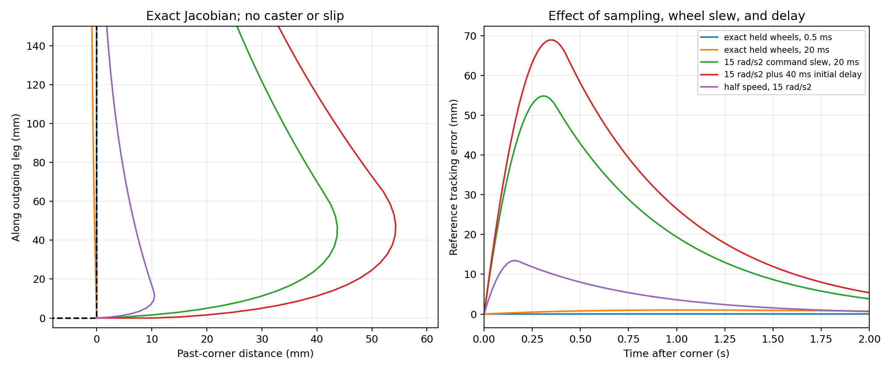

# Corner deviation: independent kinematic and trajectory audit

Commands in this guide assume a checkout of this repository. From any directory
inside that checkout, set these portable paths before running the examples:

```bash
export HAMR_REPO="$(git rev-parse --show-toplevel)"
export HAMR_RUNS="${HAMR_RUNS:-$HOME/Videos/hamr_sim}"
```

Recorded videos and full run reports are external artifacts, not files supplied
by a Git clone. Paths under `${HAMR_RUNS}` identify retained runs or new outputs
created by the recording commands.

Investigation date: 2026-09-20. This review inspects existing code and performs
offline numerical experiments. It does not modify production behavior or send
commands to hardware. Physical Gazebo experiments and hardware recordings are
covered by the companion investigation reports in this directory.

## Finding

The active inverse Jacobian is correct for its stated planar geometry. It is
well conditioned at every heading, including the corners. The main structural
problem is that the waypoint trajectory asks a moving vehicle to change its
velocity direction instantly. The recorded simulation additionally limits each
wheel command to 15 rad/s², so the corner request and actuator command constraints
are incompatible. A 90° corner produces overshoot even in an otherwise perfect
planar model with the exact geometry and no caster friction or wheel slip.

Hardware adds a second, distinct feasibility issue: with the current configured
geometry and 28 RPM wheel limit, a 0.25 m/s point velocity cannot be maintained at
all relative chassis headings. Peak nominal demand reaches approximately 30 RPM
during heading alignment. This is a calculation from configuration, rather than
a claim that current configuration was loaded in every historical recording.

## What the Jacobian actually controls

Let the differential-wheel axle center be C, chassis heading be θ, and the
tracked base point P be **b meters ahead of the axle**. Let **a be half the wheel
track**, R the driven-wheel radius, and q̇R/q̇L the right/left wheel rates. The
repository's parameter names are easy to confuse: `a_wheel` is half-track and
`b_wheel` is the forward lever arm.

The no-slip planar kinematics are

```text
v = R (q̇R + q̇L) / 2
ω = R (q̇R - q̇L) / (2a)
P = C + b [cos θ, sin θ]
Ṗx = v cos θ - b ω sin θ
Ṗy = v sin θ + b ω cos θ
θ̇ = ω
```

For turret angle ψ relative to the chassis, in the planar approximation world
turret yaw is φ = θ + ψ, so φ̇ = ω + ψ̇. Substituting wheel rates gives exactly
the active controller:

```text
              [ R/2(c - sb/a)   R/2(c + sb/a)   0 ]
[ Ṗx ]       [                                  ] [ q̇R ]
[ Ṗy ]   =   [ R/2(s + cb/a)   R/2(s - cb/a)   0 ] [ q̇L ]
[ φ̇  ]       [                                  ] [ ψ̇  ]
              [    R/(2a)          -R/(2a)      1 ]
```

Here c = cos θ and s = sin θ. Inverting the XY part is especially transparent:

```text
forward = cos θ Ṗx + sin θ Ṗy
lateral = -sin θ Ṗx + cos θ Ṗy
ω = lateral / b
q̇R = (forward + aω) / R
q̇L = (forward - aω) / R
ψ̇ = desired world turret yaw rate - ω
```

These are the equations in `run_waypoint_sim.py::inverse_drive`, which returns
left then right. The HAMR and COMPA controllers return right then left, and
their publisher assignments correctly preserve that ordering.

This is input/output linearization of an offset point. It does **not** mean the
axle center can translate sideways without turning, and it does not allow
independent control of chassis heading in addition to XY with only two wheels.
The turret supplies independent upper-platform yaw. The offset-point construction
and coupled wheel-speed constraint are also described in [Trakas, Anogiatis,
and Bechlioulis, Sensors 2024](https://www.mdpi.com/1424-8220/24/14/4636), sections
2 and 3.1. The derivation above is independently calculated for this repository's
axis and wheel ordering.

The current hardware profile disables the turret. This removes independent
upper-platform yaw control; because the turret column in the XY rows is zero,
it does not invalidate the XY inverse mapping. Holding chassis yaw at zero
through this route would require a different physical drive capability.

## Singularities and numerical verification

For the two-wheel XY mapping, the singular values are

```text
σ1 = R / sqrt(2)
σ2 = R b / (a sqrt(2))
```

Both are independent of heading. The determinant is -R²b/(2a). Only degenerate
geometry such as b = 0 removes the independent lateral velocity of P. Neither
the sine/cosine values at cardinal headings nor a 90° waypoint change creates a
matrix singularity. The dimensionally consistent XY condition number is
`max(a/b, b/a)`; a condition number for the full mixed-meter/radian Jacobian
would require choosing a length scale and is less informative.

| Configuration | R (m) | a, half-track (m) | b, forward offset (m) | XY condition number |
|---|---:|---:|---:|---:|
| Current recorded COMPA retrofit simulation | 0.1075 | 0.33072 | 0.27114 | 1.21974 |
| Current hardware control YAML | 0.122 | 0.350 | 0.301 | 1.16279 |
| Legacy COMPA controller defaults | 0.1075 | 0.331643 | 0.274986 | 1.20604 |

The current expanded simulation URDF places the wheel centers at nominal
base-relative x = -0.27114 and y = ±(0.185 + 0.14572) = ±0.33072 m. Both wheel
joint axes are +Y, consistent with positive rates driving forward. Its collision
cylinders have radius 0.1075 m. The odometry model origin and base footprint
share their XY origin. Rocker articulation can slightly change the projected
geometry; the inverse is a flat-ground nominal model.

The old COMPA defaults differ from this nominal URDF by approximately +1.42% in
offset and +0.279% in half-track. The new recording runner uses the URDF-derived
values, so those legacy differences do not explain the recorded corner spike.

The hardware controller adds `base_yaw_offset = π/2` to raw Vicon yaw before
inverse kinematics. This is consistent with the documented hardware forward
axis, but geometry and marker-to-axle alignment still require physical
calibration. Source-code algebra cannot independently certify their measured
values. Radius, axle spacing, lever arm, yaw offset, wheel slip, motor response,
and timing errors can all contribute to real hardware mismatch.

`kinematics_experiment.py` extracts the actual HAMR and COMPA inverse methods
and the simulation adapter by Python AST, without importing ROS. For 10,000
random headings, velocities, radii, tracks, and offsets, it compares these
functions against the independent forward equations above. Maximum forward
residual was 2.67e-15; maximum HAMR-versus-adapter wheel-rate difference was
3.56e-14 rad/s. This establishes algebraic equivalence, not real-wheel
calibration. Reproduce with:

```bash
cd "${HAMR_REPO}"
/usr/bin/python3 hamr_ball_caster/docs/corner_analysis/kinematics_experiment.py
```

`hamr_controller_hw.py` contains an old `use_diff_drive = True` branch that
discards the independent lateral command. It would be inappropriate for this
holonomic-point route, but `hamr_HW.launch.xml` launches the `hamr_controller`
entry point, mapped in `hamr_control/setup.py` to `hamr_controller.py`; that active
controller has `use_diff_drive = False`. The archived file is not evidence that
the current run uses the wrong inverse.

## Why a mathematically correct inverse still overshoots

`WaypointTraj` divides each straight-line length by the requested speed,
assigns constant velocity to that segment, and changes segment at its scheduled
time. The position is continuous, but the velocity is not. The four actual
90° corners of the 13 m route occur at 8, 16, 26, and 34 seconds at 0.25 m/s.
The 44-second point is a collinear waypoint and does not change velocity.

At a 90° corner and 0.25 m/s, the desired velocity jump has magnitude
`sqrt(0.25² + 0.25²) = 0.353553 m/s`. Exact execution in zero time requires
unbounded acceleration. Treating a one-sample transition as 20 ms still implies
17.68 m/s²; at 10 ms it implies 35.36 m/s². Increasing control frequency makes
the discretized acceleration demand larger rather than making it physically
feasible. Starting and stopping also introduce velocity steps.

The nominal simulation is approximately aligned with the incoming segment
before each long-leg corner. Its required wheel transition at an ideal left
turn is:

| Quantity | Before the corner | Immediately after the corner |
|---|---:|---:|
| Axle forward speed | 0.25 m/s | 0 m/s |
| Chassis yaw rate | 0 rad/s | 0.922033 rad/s |
| Right wheel | +2.325581 rad/s | +2.836602 rad/s |
| Left wheel | +2.325581 rad/s | -2.836602 rad/s |

One wheel must reverse by 5.162183 rad/s. At the configured 15 rad/s² limit,
that initial target change takes 0.344146 s if heading and target are frozen.
The actual closed-loop target evolves throughout the transition, so this is
an explanatory local calculation, not an exact prediction of the ramp duration.
During the transition the robot still has incoming-direction velocity. It
passes beyond the corner. Position feedback then commands motion back toward
the new moving reference: the visible spike and recovery.

Independent wheel slew limiting also changes the desired wheel ratio during
the transition; it does not preserve the instantaneous requested curvature.
This is expected when a velocity-level inverse is followed by independent
actuator constraints. Limiting a command after reaching the corner cannot
anticipate the braking required before it.

The distinction between setting motor velocities instantly and modeling bounded
motor accelerations is explicit in [LaValle, Planning Algorithms, section
13.2.4.3](https://lavalle.pl/planning/node677.html). A nonsingular velocity
Jacobian addresses instantaneous kinematic reachability; it does not establish
dynamic feasibility.

## Mechanism isolated without Gazebo, casters, or slip

The offline experiment starts exactly at a 90° corner with the chassis aligned
to the incoming segment and both wheels already at steady speed. It uses the
correct geometry, exact integration of each held wheel command, perfect pose,
P gain 1.5, and no friction, compliance, actuator response lag, or caster model.
Only the listed sampling, slew, and optional initial command delay differ.

| Offline case | Peak reference error | Incoming overshoot | Time of peak |
|---|---:|---:|---:|
| Immediate wheels, 0.5 ms updates | 0.025 mm | 0 mm | 1.069 s |
| Immediate wheels, 20 ms updates | 1.013 mm | 0 mm | 1.060 s |
| 15 rad/s² slew, 20 ms updates | 54.825 mm | 43.718 mm | 0.300 s |
| Same slew, 40 ms initial corner-command delay | 68.933 mm | 54.324 mm | 0.340 s |
| Half speed, same slew and 20 ms updates | 13.481 mm | 10.497 mm | 0.160 s |

The 40 ms delay is a deliberate sensitivity example, **not a fitted or measured
delay claim**. With continuous inverse updates and unlimited wheel acceleration,
zero initial tracking error stays identically zero: Ṗ is the requested
reference velocity by construction. The small unlimited-wheel numerical errors
above shrink with the command interval.



Results are saved in `kinematics_results.json`. The experiment proves that the
slew constraint is sufficient to create this type and scale of deviation. It
does not assign the full hardware error to a single mechanism.

The independent full-vehicle Gazebo ablation performed during this investigation
is consistent with that distinction: the original case reached 66.50 mm peak
tracking error; removing the effective slew restriction reduced it to 37.36 mm,
but did not eliminate it. At the first corner the wheel rates changed promptly
while chassis forward velocity remained about 0.253 m/s and decayed over roughly
0.15 s. An instantaneous velocity command to a rotating wheel does not instantly
change the vehicle's linear momentum; contact slip and finite ground forces
remain in the physics model. In contrast, a stop-at-corner quintic reference in
the full simulation had a global peak of 8.24 mm and four corner peaks no larger
than 3.17 mm. These are controlled simulation experiments, not validation of
hardware acceleration or friction values. See the companion simulation report
for full cases and raw data.

## Hardware speed feasibility is also heading dependent

For a desired point speed s and direction error δ relative to the chassis,

```text
q̇R = s/R [cos δ + (a/b) sin δ]
q̇L = s/R [cos δ - (a/b) sin δ]
```

Therefore the worst required wheel rate across all directions is
`s/R sqrt(1 + (a/b)²)`. With hardware parameters in the current YAML:

- At s = 0.25 m/s, this peak is 3.142725 rad/s, approximately 30.01 RPM.
- The configured 28 RPM ceiling is 2.932153 rad/s.
- All-direction feasible point speed without feedback reserve is at most
  0.233249 m/s. A robust reference needs additional margin for correcting errors.
- For a 90° heading alignment, nominal saturation occurs when direction error
  is approximately 28.21°–70.40°, peaking at 49.30°.
- At 0.20 m/s the nominal peak falls to 2.514180 rad/s, below the ceiling.

Thus checking only straight-line speed or the instant of the 90° turn misses
the worst wheel demand. Pair scaling preserves instantaneous commanded
curvature, but slows the point relative to its unchanged time schedule. Feedback
then asks the already constrained drive to recover the lag.

An ideal 1 ms planar test with just this hardware geometry and speed cap,
instant wheel response, no slew limit, and P = 1.5 produces 14.466 mm peak
reference error. This is another mechanism demonstration; hardware uses
different gains and motor dynamics, so it is not a forecast of its error.

The current hardware D term is a filtered velocity error, not the older
finite difference of asynchronously held pose errors. A velocity reference
step still enters that term, but the current gains have I_x = I_y = 0, so
outer XY integral windup is not an explanation for current-profile corners.
Wheel-controller integral saturation is a separate issue evaluated from
firmware telemetry in the hardware report.

## Chassis rotation versus actual path error

Even when P tracks perfectly, chassis heading need not instantly match the
new segment. For constant reference direction γ and exact tracking,

```text
δ = γ - θ
δ̇ = -(s/b) sin δ
tan(δ(t)/2) = tan(δ(0)/2) exp(-s t/b)
```

The small-error heading time constant is b/s: 1.08456 s for the simulation and
1.204 s for the current hardware parameters at 0.25 m/s. Gradual chassis
rotation while the offset point moves sideways is expected behavior. Under
these ideal assumptions the heading approaches its new direction monotonically;
this internal alignment alone does not require the tracked point to overshoot.

## What would address the cause

If the geometric path must retain exact sharp corners, its time law must reduce
speed to zero at every actual corner, then accelerate along the next segment.
A smooth stop/start profile can retain every waypoint and every straight edge,
but it changes the 52-second constant-speed schedule. If nonzero corner speed
is required, the geometric corner must be rounded with bounded curvature and
its speed chosen from wheel velocity, acceleration, torque, and traction limits.
The two requirements—an exact geometric corner and nonzero velocity at that
corner—cannot both hold under finite acceleration.

Planning should consider the wheel constraints before producing the reference.
Acceleration and jerk limits should be enforced on a trajectory that remains
consistent with its position and velocity fields, rather than independently
filtering `x_dot`/`y_dot` while retaining the old position schedule. Tools such as
[Berscheid and Kröger's Ruckig algorithm, RSS
2021](https://www.roboticsproceedings.org/rss17/p015.pdf) explicitly consider
velocity, acceleration, and jerk; any use here would also have to enforce the
HAMR wheel mapping and coupled limits, not just independent Cartesian bounds.

Controller tuning, higher-rate feedback, and parameter calibration are useful
after reference feasibility is addressed. Increasing gains or removing the
simulation slew limit can conceal a model limitation without making the same
request physically executable by the real vehicle.

## Code locations inspected

- `reference_trajectory/reference_trajectory/waypoint_traj_simple.py`, lines
  664–723: constant segment velocities and timed segment switch.
- `hamr_control/hamr_control/hamr_controller.py`, lines 963–1104 and 1463–1589:
  yaw offset, feedforward/PID, Jacobian, and wheel-pair limiting.
- `hamr_bringup/config/hamr_hw_control_params.yaml`: current geometry, gains,
  velocity feedback selection, disabled turret, and wheel-speed ceiling.
- `hamr_bringup/launch/hamr_HW.launch.xml` and `hamr_control/setup.py`: active
  controller routing.
- `compa_control_py/compa_control_py/compa_controller.py`, lines 478–508:
  legacy COMPA inverse.
- `hamr_ball_caster/scripts/run_waypoint_sim.py`, lines 67–74 and 241–260:
  equivalent inverse and explicit per-wheel acceleration limiting.
- `hamr_ball_caster/config/simple_waypoint_sim.yaml`: original route and
  simulation geometry/limits.
- `hamr_ball_caster/urdf/compa_ball_caster.urdf.xacro`: wheel joint origins and
  collision radii.
