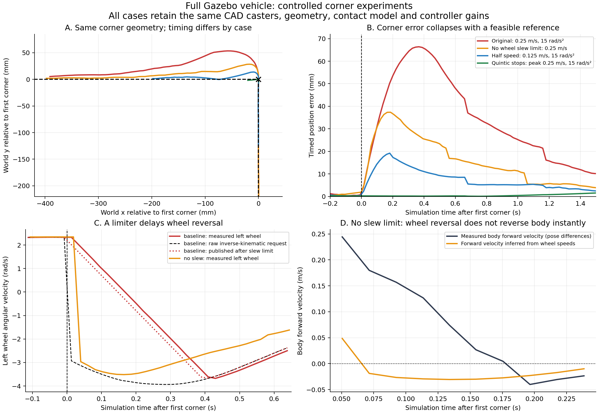

# Controlled Gazebo corner experiments

Commands in this guide assume a checkout of this repository. From any directory
inside that checkout, set these portable paths before running the examples:

```bash
export HAMR_REPO="$(git rev-parse --show-toplevel)"
export HAMR_RUNS="${HAMR_RUNS:-$HOME/Videos/hamr_sim}"
```

Recorded videos and full run reports are external artifacts, not files supplied
by a Git clone. Paths under `${HAMR_RUNS}` identify retained runs or new outputs
created by the recording commands.

Executed 2026-09-20 against the full COMPA/HAMR retrofit with both CAD ball casters, Gazebo Sim 8.15.0, DART, nominal ground friction 0.8, and ideal wheel/gimbal velocity actuators. All five fresh simulations completed the route and passed the existing runner's checks. Every simulator process group launched for this study was stopped afterward. No hardware was commanded, and no production launch file, controller, URDF, or configuration was changed.



The production route has six straight segments and four 90-degree corners. Waypoint 5 is collinear and is not a turning corner. The production timing commands a nonzero-speed, instantaneous change in reference velocity at a corner. These experiments change one major constraint at a time while retaining the same caster geometry, body inertias, ground contact, controller gains, and route coordinates.

## Results

The RMS and peak errors below are distances from the measured position to the **time-scheduled reference**, over the complete motion phase. Geometric cross-track is the shortest distance to any segment of the waypoint polyline. The corner-local figures use the two seconds after each of the four real corners. These are different metrics: a vehicle can pass close to a waypoint and still overshoot afterward.

| Experiment | Motion time | Peak reference speed | Wheel acceleration limit | Physics step | RMS timed error | Peak timed error | Peak geometric cross-track |
| --- | ---: | ---: | ---: | ---: | ---: | ---: | ---: |
| Original controller settings | 52.0 s | 0.25 m/s | 15 rad/s² | 1 ms | 13.64 mm | 66.50 mm | 53.67 mm |
| Wheel slew limit effectively removed | 52.0 s | 0.25 m/s | 10,000 rad/s² | 1 ms | 7.27 mm | 37.36 mm | 28.86 mm |
| Half speed, original limiter | 104.0 s | 0.125 m/s | 15 rad/s² | 1 ms | 2.77 mm | 19.20 mm | 14.93 mm |
| Quintic stop at every waypoint | 97.5 s | 0.25 m/s | 15 rad/s² | 1 ms | 1.80 mm | 8.24 mm | 6.86 mm |
| No slew limit, half physics step | 52.0 s | 0.25 m/s | 10,000 rad/s² | 0.5 ms | 6.75 mm | 36.09 mm | 27.70 mm |

The repeat baseline differs slightly from the recorded video run (64.01 mm peak): this experiment retains every controller update, runs headlessly, and has independent ROS/physics scheduling. All ablation cases use the same instrumentation. The mechanism and error scale repeat.

| Experiment | Corner 1 peak | Corner 2 peak | Corner 3 peak | Corner 4 peak |
| --- | ---: | ---: | ---: | ---: |
| Original settings | 66.40 mm | 66.50 mm | 61.36 mm | 65.23 mm |
| No slew limit | 37.36 mm | 37.07 mm | 37.28 mm | 36.37 mm |
| Half speed | 19.20 mm | 19.19 mm | 18.88 mm | 19.05 mm |
| Quintic stops | 3.17 mm | 0.54 mm | 1.45 mm | 0.79 mm |
| No slew limit, half step | 36.09 mm | 35.69 mm | 31.74 mm | 35.56 mm |

For the original settings, the incoming-direction overrun is 46.93–53.67 mm, and the outgoing-direction lag is 39.77–41.91 mm. Peaks occur about 0.37 s after the corner. The no-slew case peaks about 0.17–0.19 s after the corner. The collinear waypoint produces only about 3 mm of timed error in the original settings; it is explicitly excluded from geometric corner-overrun calculations.

## What the intervention proves

**The explicit simulation wheel slew limiter is a major cause.** At the first corner, the inverse-kinematic request changes the left wheel from approximately +2.35 to -2.96 rad/s. The original limiter initially withholds about 4.94 rad/s of that request. Measured wheel velocity follows the previously published limited command within approximately 5e-10 rad/s at the corner, so the simulation is executing the ramp supplied to it. Removing that ramp lowers the full-run peak from 66.50 to 37.36 mm, with all other physical settings unchanged. This is a controlled causal intervention; it is not a claim that the same explicit software limiter exists in the hardware pipeline.

**Removing the wheel limit cannot make the body change velocity instantly.** In the no-slew case, the joint feedback reports the reversed left wheel within one approximately 21 ms controller cycle, but the vehicle continues moving into the old direction. Position differences, evaluated using their simulator timestamps, show its body-forward velocity decreasing from about 0.24 m/s to nearly zero over approximately 0.12 s. The measured yaw rate builds over the same interval. This is consistent with finite contact forces and body dynamics despite ideal wheel velocity actuation.

A timestamp-aligned rolling-constraint diagnostic makes this distinction explicit. For measured body-forward velocity `u` and yaw rate `omega`, rigid-body longitudinal velocities at the nominal wheel positions are `u - half_track*omega` and `u + half_track*omega`. These should equal `R*wheel_rate` under ideal rolling. The offset from the axle affects the base's lateral velocity, `offset*omega`, not its forward velocity. Therefore the comparison does account for the offset-drive geometry.

During 50–250 ms after the first corner, the maximum wheel-surface minus body-wheel-point velocity residual is:

| Experiment | Peak absolute longitudinal rolling residual |
| --- | ---: |
| Original settings | 0.0185 m/s |
| No slew limit | 0.4114 m/s |
| Half speed | 0.0243 m/s |
| Quintic stops | 0.00020 m/s |
| No slew limit, half step | 0.4553 m/s |

The no-slew residual is about 0.01 m/s in the preceding steady straight interval. Thus its approximately 0.4 m/s corner discrepancy is not explained by a small constant Jacobian scale error. It indicates a strong departure from ideal rolling during abrupt reversal. The diagnostic uses interpolation of approximately 21 ms joint observations onto the same source-time interval as the pose differences; uncertainty around a discontinuity is approximately one controller period. The values 50–250 ms after the corner avoid relying only on the first abrupt sample. Small rocker motion and the true contact-patch location are not modeled by this diagnostic, so it is not a calibrated tire-slip sensor or contact-force measurement.

The reduced physics step leaves a similar 36.09 mm peak, versus 37.36 mm at 1 ms. The principal effect is therefore not eliminated by halving the integration step. One step-halving trial is evidence of persistence, not a full numerical convergence proof. The retained half-step launch log states `DART step=0.0005s` and records the exact generated world file subsequently loaded by Gazebo. The pre-existing launch argument writes that value into `physics/max_step_size`; no launch implementation changes were needed. Temporary runtime world files are removed by the existing launch cleanup, so the retained evidence is the source implementation, launch log, and sampled timestamps.

**Changing the reference to a physically feasible one removes most corner spikes without changing the Jacobian or caster.** The quintic experiment uses the same straight-line geometry with the fraction

`f(u) = 10u³ - 15u⁴ + 6u⁵`, for `0 <= u <= 1`.

Each segment duration is `1.875 * segment_length / 0.25`, giving a maximum reference speed of 0.25 m/s and zero velocity and acceleration at each waypoint. Total motion time changes from 52.0 to 97.5 seconds. It also stops at the collinear waypoint; this is deliberately an experimental time law, not a drop-in production change.

The observed maximum wheel-command acceleration is **4.44 rad/s²**, below the unchanged 15 rad/s² limit. The raw and published wheel commands match throughout, so the wheel slew limiter never activates. Maximum commanded wheel speed is 2.70 rad/s, below the unchanged 6 rad/s cap. Maximum feedback-corrected translation request is 0.254 m/s, while the reference itself remains at or below 0.25 m/s. Corner-local peaks fall to 0.54–3.17 mm; the global 8.24 mm peak occurs 3.89 seconds into the later straight segment after corner 4, not at the corner transition.

These results do not identify the entire residual with a particular caster part or material. No caster-removal, contact-force, or calibrated material study was performed. The unchanged caster tracks the feasible corners accurately, so a caster-specific or Jacobian-algebra defect is unnecessary to explain the original corner spikes. Contact, inertia, passive caster forces, estimator age, discretization, and feedback all interact; differences between the experiments should not be interpreted as additive percentages of one error budget.

## Data and reproduction

- [Computed metrics](experiments/metrics.json), including every corner and source age statistics.
- [Timestamp-aligned wheel/body diagnostic](experiments/wheel_body_residual.json).
- [Original controller instrumentation provenance](experiments/instrumentation.json).
- Raw full traces (`baseline.json`, `no_slew.json`, `half_speed.json`, `quintic_stop.json`, and `no_slew_half_step.json`) are preserved in the [external experiment archive](../ARCHIVED_ARTIFACTS.md). That guide includes the hash manifest and restoration commands.
- Launch logs, exact copied configurations, experiment runners, and analysis scripts are retained in `experiments/`.
- [Vector figure for export](gazebo_ablation_comparison.pdf).

Each trace includes requested and limited wheel commands, actual wheel and passive joint velocities, positions, control intervals, odometry timestamps, joint-state timestamps, and simulation time. The baseline median controller interval is 21 ms; median odometry age is 10 ms and median joint-state age is 1 ms. Control/transport sampling contributes to the residual and is not assumed to be zero.

From `${HAMR_REPO}`, reproduce the cases sequentially:

```bash
source hamr_ball_caster/scripts/env.sh
/usr/bin/python3 hamr_ball_caster/docs/corner_analysis/experiments/run_ablations.py \
  baseline no_slew half_speed quintic_stop no_slew_half_step
/usr/bin/python3 hamr_ball_caster/docs/corner_analysis/experiments/analyze_ablations.py
/usr/bin/python3 hamr_ball_caster/docs/corner_analysis/experiments/wheel_body_residual.py
/usr/bin/python3 hamr_ball_caster/docs/corner_analysis/experiments/plot_ablations.py
```

The experiment harness assigns ROS domains 70–74 and unique Gazebo partitions, and shuts down the complete owned process groups. Only simulation bridge topics are commanded. The no-slew case is a diagnostic intervention; it is not a recommended hardware setting.
