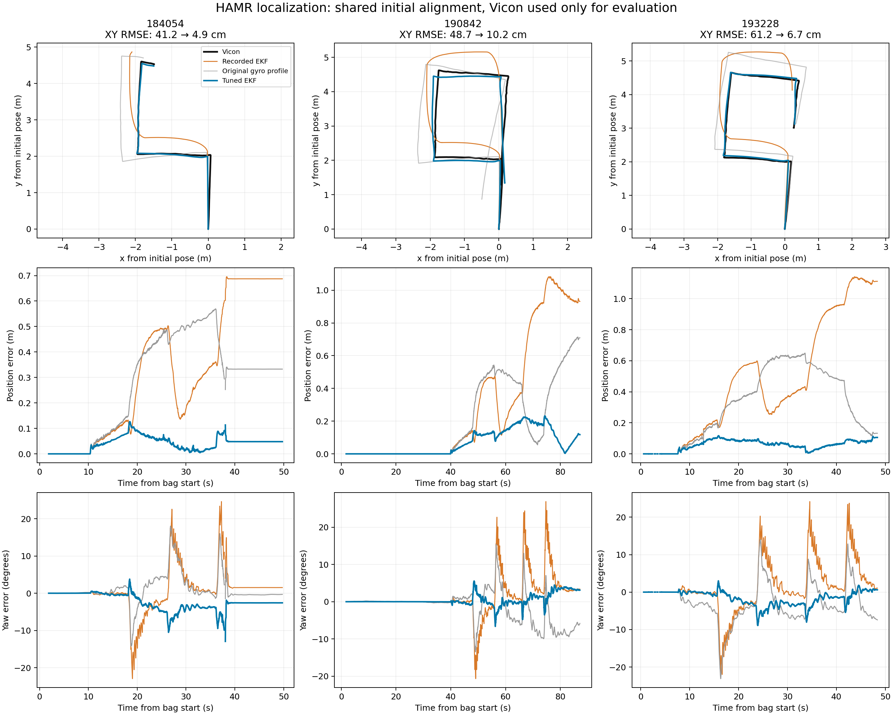

# HAMR EKF tuning — 20 September 2026

The selected encoder + IMU configuration reduces position RMSE from **41.2 / 48.7 / 61.2 cm to 4.9 / 10.2 / 6.7 cm** on the three supplied recordings. The same settings were verified with the actual ROS Jazzy `robot_localization` node. Vicon was used to fit and evaluate parameters, never as a filter measurement.



## Measured results

All estimates use the same 50 Hz evaluation grid and the same initial reference pose. Only initial translation and heading are removed; no best-fit path rotation, scale, or time shift is applied. Intervals spanning a Vicon receipt gap over 100 ms are masked identically for every estimate. Sensor message timestamps drive the EKF; local receipt timestamps locate Vicon because its source clock is not synchronized with the robot.

| Recording suffix | Recorded EKF XY RMSE | Original gyro profile XY RMSE | Tuned XY RMSE | Reduction vs recorded | Tuned final XY error | Tuned yaw RMSE |
|---|---:|---:|---:|---:|---:|---:|
| 184054 | 0.412 m | 0.340 m | **0.049 m** | 88.2% | 0.048 m | 3.23° |
| 190842 | 0.487 m | 0.310 m | **0.102 m** | 79.1% | 0.117 m | 1.58° |
| 193228 | 0.612 m | 0.395 m | **0.067 m** | 89.0% | 0.106 m | 2.46° |

The original gyro profile was the version of `ekf.yaml` used at the time of tuning, replayed with the original recorded inputs. The current `ekf.yaml` now matches `ekf_calibrated.yaml`; the baseline results above refer to the earlier configuration retained in Git history. The recorded EKF is `/local_HAMR/odom` from each source bag; those bags lack a parameter snapshot. The original hardware default, `ekf_mag.yaml`, reproduces the recorded filter closely, but this is not proof of the historical loaded YAML.

The second recording includes a long stationary lead-in. Moving-only tuned XY RMSE is **0.056 / 0.137 / 0.071 m**, using a fixed Vicon motion mask described in [metrics.json](metrics.json). Its recorded-filter counterparts are 0.317 / 0.653 / 0.640 m. Full-run mean of the three tuned RMSE values is **0.0726 m**; this is a mean of bag RMSEs, not a pooled-time RMSE.

Actual-node replay produced **0.04886 / 0.10194 / 0.06698 m** XY RMSE. All **21,140** wheel/IMU measurements were processed in timestamp order, with approximately 50 Hz output. Actual-node and fast-core trajectories differ by **0.14 / 0.49 / 0.41 mm RMS**. The node validation used larger transport queues to isolate numerical agreement from dropped messages. See [ROS validation](ros_node_validation.json) and the effective YAML/debug logs under `../engine_results/`.

## What was wrong

1. The hardware default used **wheel vy only**, with IMU quaternion yaw and gyro. Its comments incorrectly described other selections. Missing wheel vx removed the tracked point's velocity during turns.
2. The wheel publisher computed world velocity at the old heading, advanced heading, then rotated that velocity into the new body frame. This introduced an erroneous `-yaw_rate * dt` rotation in the published twist. The publisher now computes body velocity directly.
3. The recorded wheel rotation was approximately 20% too large, and the configured 0.45 m tracked-point lever arm was inconsistent with the measured motion. Joint calibration of forward speed, yaw rate, and lever arm gives a much better motion model.
4. IMU publication rate concealed stale data: **95.48% of complete payloads are exact repeats**. Only about **2.97 Hz** of new orientation/gyro/acceleration payloads arrive despite approximately 65 Hz publication. Changed gyro samples lag Vicon by about 0.20 s; repeated values increase apparent average lag to about 0.36 s. The relay stamps receipt time rather than acquisition time. Firmware acquisition code is absent from this repository.

The IMU yaw sign is correct in these recordings. Earlier comments suggesting reversal should not be used as calibration evidence. All three recordings reported magnetometer calibration status zero. Quaternion-yaw and acceleration fusion were tested, but did not improve the selected calibrated model.

## Selected settings

| Setting | Value |
|---|---:|
| Wheel forward-speed multiplier | **0.95** |
| Wheel yaw-rate multiplier | **0.813** |
| Effective tracked-point lever arm `b_wheel` | **0.28 m** |
| Wheel vx variance | **0.0002 (m/s)²** |
| Wheel vy variance | **0.0002 (m/s)²** |
| Wheel yaw-rate variance | **0.004 (rad/s)²** |
| IMU gyro-z variance | **0.04 (rad/s)²** |
| Wheel measurements | **vx, vy, yaw rate** |
| IMU measurements | **gyro z only** |
| Process noise Q / initial covariance P0 | **original `ekf.yaml` values** |

These are effective fusion weights and motion calibration for this hardware/data, not independently measured sensor noise or CAD dimensions. Wheel vx and yaw-rate errors are correlated by the lever-arm relationship; the retained diagonal covariance is an approximation. The larger gyro variance limits the influence of repeatedly published, delayed samples. No time shifts, future sensor readings, Vicon corrections, or duplicate-dropping are used in the selected implementation.

The original wheel radius, half-spacing, tick calibration, and frame convention remain explicit in `wheel_odometry_calibration.yaml`. Calibration multipliers act separately on axle speed and yaw rate; the new lever-arm velocity uses the calibrated yaw rate. Controller kinematics are separate from these odometry settings.

## Experiments and overfitting checks

The saved experiment logs contain **9,229 baseline/Sobol configurations**: 13 sensor-selection and duplicate-handling baselines, 3,072 covariance/selection candidates, and 6,144 calibration/covariance candidates. Each is evaluated on all three bags. A further **1,524 numerical objective evaluations** refine compact models, test duplicate suppression and weak quaternion yaw, and refit with one recording excluded. Logs retain the tested settings and per-bag metrics in `../results/*.jsonl`.

Covariance tuning alone reached approximately **0.146 / 0.144 / 0.142 m**. Calibration provided the largest further improvement. Three different starting covariance scales converged to essentially the same compact six-parameter wheel/gyro fit. Rounded deployment values preserve its accuracy. More complicated yaw/duplicate alternatives did not improve the selected model.

Refitting this model on two bags and evaluating the excluded third gives **0.060 / 0.115 / 0.117 m** XY RMSE. These are exploratory leave-one-bag-out checks after model exploration, not an untouched independent test of the final all-bag calibration. They support a shared calibration rather than separate per-recording settings. They do not establish accuracy on a different surface, speed, load, or longer route.

An independent review repeated scoring with stricter Vicon-backlog masking and shifted the common alignment start by up to one second. The gain persisted; alignment changes affected candidate RMSE by less than 0.7 mm. Stationary position drift remained zero in the examined stop interval, and yaw-rate noise decreased. Those sensitivity checks used the nearly identical pre-rounding candidate; exact parameters are recorded in [evaluation_sensitivity.json](evaluation_sensitivity.json).

## Source changes and deployment

Verification passed **559 tests** across the relevant offline tools, EKF adapter,
odometry, bringup, controller, trajectory and experimental-control tests. Two
pre-existing tests still fail because this checkout lacks
`hamr_study_reference.launch.xml` and `hamr_HW_waypoint_vicon_unprotected.launch.xml`.
These failures were identified before the EKF changes. The relay also passed a
native C++ build and a real binary-packet/ROS test through a pseudo-terminal,
including variance overrides, simulation-time stamps, and eight invalid-value
rejection cases. Generated message packages and bringup were built locally;
the installed hardware launch's argument/config resolution was checked without
starting hardware nodes.

The default `hamr_HW.launch.xml` now loads:

- `hamr_bringup/config/ekf_calibrated.yaml`
- `hamr_bringup/config/wheel_odometry_calibration.yaml`
- `hamr_bringup/config/hamr_uros_bridge.yaml`, with gyro variance 0.04

Wheel calibration/covariances and IMU yaw/gyro variances are configurable and checked for positive finite values. IMU/magnetometer stamping now uses the node clock, so simulation-time behavior is correct. Both `ekf.yaml` and `ekf_calibrated.yaml` now contain the selected calibrated EKF parameters. The `ekf_mag.yaml` and `ekf_orientation.yaml` profiles remain available as alternatives. Explicit `use_mag:=true` or `use_orientation:=true` selects those alternatives; the tested default has both false. Launches loading `ekf.yaml` now inherit the calibrated measurement selection; the full calibrated setup also requires the wheel calibration and sensor variances listed above.

Rebuild the affected packages in your robot workspace before using the new live defaults:

```bash
source /opt/ros/jazzy/setup.bash
cd /path/to/your/ros_workspace
colcon build --symlink-install --packages-select hamr_odometry hamr_uros_bridge hamr_bringup
source install/setup.bash
```

Then use your normal `ros2 launch hamr_bringup hamr_HW.launch.xml` command. No hardware was started during this tuning work.

## Reproduce offline

See [OFFLINE_EKF_QUICKSTART.md](../../../OFFLINE_EKF_QUICKSTART.md) for the complete replay commands. Prepared copies of all three original recordings are under `../prepared/`, each containing frozen `ekf.yaml`, covariance/calibration snapshots, and a provenance manifest. Original bags are unchanged. Reapplying the legacy correction to already-calibrated data is rejected for marked copies; future live recordings must use the covariance-only helper instead.

Full copy validation checked **283,279 messages**, including **19,450 byte-identical Vicon odometry messages**. Original MCAP checksums, all header/recording times, non-target payloads, wheel poses, topic QoS and embedded message definitions are preserved. Prepared wheel/IMU values agree with the numerical experiment inputs to within `7.89e-12`. See [replay preparation validation](replay_preparation_validation.json).

The fast numerical runner vendors the unmodified BSD-licensed `robot_localization` Jazzy EKF at commit `3efa714fb9c1ff40966327b7bed7053b2570be4d`. It was also compared to packaged version 3.8.3, with bit-identical numerical outputs. It implements planar, identity-frame measurement preparation for these sensors; it is not a replacement for the complete ROS transport/TF layer. [Engine documentation](../engine_README.md) records its scope and actual-node checks.

```bash
cd /home/para/hamr_control
source /opt/ros/jazzy/setup.bash
bash rosbags/ekf_tuning/engine_build.sh
/usr/bin/python3 rosbags/ekf_tuning/extract.py \
  rosbags/hamr_hw_20260916_184054 \
  rosbags/hamr_hw_20260916_190842 \
  rosbags/hamr_hw_20260916_193228
OPENBLAS_NUM_THREADS=1 /usr/bin/python3 rosbags/ekf_tuning/generate_report.py
```

Repeat the searches with `tune.py --stage covariance --trials 3072`, `tune.py --stage calibrated --trials 6144`, `refine.py`, and `refine_variants.py`. They use fixed seeds and fresh EKF state for every evaluation. Large recordings, generated caches, native libraries, ROS runtime downloads, and raw trial/debug logs remain local ignored artifacts; source, selected settings, summary metrics and plots are retained for review.

## Remaining limits

The paths align closely, but not perfectly. The second recording still has approximately 23 cm maximum transient position error, and wheel slip plus low-rate delayed IMU data remain visible. Better IMU acquisition frequency and true acquisition timestamps are the next hardware/firmware improvement. A new recording after that change should be used to reassess gyro weights. Wheel/IMU dead reckoning has no independent absolute-position correction, so these short recorded tests cannot establish bounded long-term drift.

Repository code, configurations, launch paths, existing analyses, and tests were reviewed across the packages; [repository audit](../repository_audit.md) records the architecture and pre-existing issues. Two supplied PDFs are truncated and could not be fully read. Binary CAD assets added during the work were not used to infer physical dimensions; the lever arm above is explicitly fitted.

Primary implementation reference: [upstream robot_localization configuration guidance](https://github.com/cra-ros-pkg/robot_localization/blob/jazzy-devel/doc/configuring_robot_localization.rst). All numerical results above come from the supplied recordings and saved local experiments.
